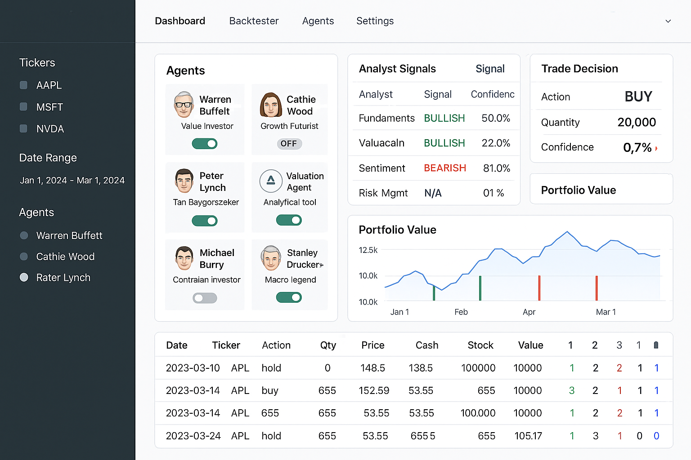

# Gekko

> Simulate a multi-agent investment strategy powered by legendary investor personas and real-time data. Built for experimentation, education, and showcasing AI-driven portfolio logic.



---

## 🚀 Overview

This is an AI Hedge Fund Platform, it is a proof-of-concept project exploring how multiple AI agents—each inspired by a legendary investor—can collaborate to generate trading signals and make portfolio decisions. This project simulates, analyzes, and visualizes those decisions through a fully integrated ReactJS dashboard.

⚠️ **Disclaimer:** This is not a real trading system. It is for educational and experimental use only.

---

## 👥 Agent Roster

| Agent               | Style Description                                      |
|---------------------|--------------------------------------------------------|
| **Ben Graham**       | Value investor, margin of safety fanatic              |
| **Bill Ackman**      | Activist investor, high conviction bets               |
| **Cathie Wood**      | Innovation futurist, disruptive tech seeker           |
| **Charlie Munger**   | Business quality purist                               |
| **Michael Burry**    | Contrarian deep value hunter                          |
| **Peter Lynch**      | Ten-bagger chaser, practical growth                   |
| **Phil Fisher**      | Scuttlebutt-driven growth researcher                  |
| **Stan Druckenmiller** | Global macro visionary                              |
| **Warren Buffett**   | Buy wonderful businesses at a fair price             |
| **Valuation Agent**  | Computes intrinsic value                              |
| **Sentiment Agent**  | Scans market sentiment                                |
| **Fundamentals Agent** | Parses balance sheets and KPIs                      |
| **Technicals Agent** | Interprets chart patterns and indicators              |

---

## 🖥️ Features

- 🔄 **Simulated Trading Engine**
- 🧠 **LLM-Powered Agents** (OpenAI, Groq, Ollama)
- 📊 **ReactJS Frontend Dashboard** for visual monitoring
- 💼 **Portfolio Manager + Risk Manager** integration
- 📆 **Date Range Control + Backtesting**
- 💡 **Explainable Reasoning via `--show-reasoning` flag**
- 📈 **Live and Historical Trade Logs**

---

## 📸 Dashboard Preview


---

## ⚙️ Setup

### 🔧 Using Poetry (recommended)

```bash
git clone https://github.com/peteralcock/gekko.git
cd ai-hedge-fund
curl -sSL https://install.python-poetry.org | python3 -
poetry install
cp .env.example .env

